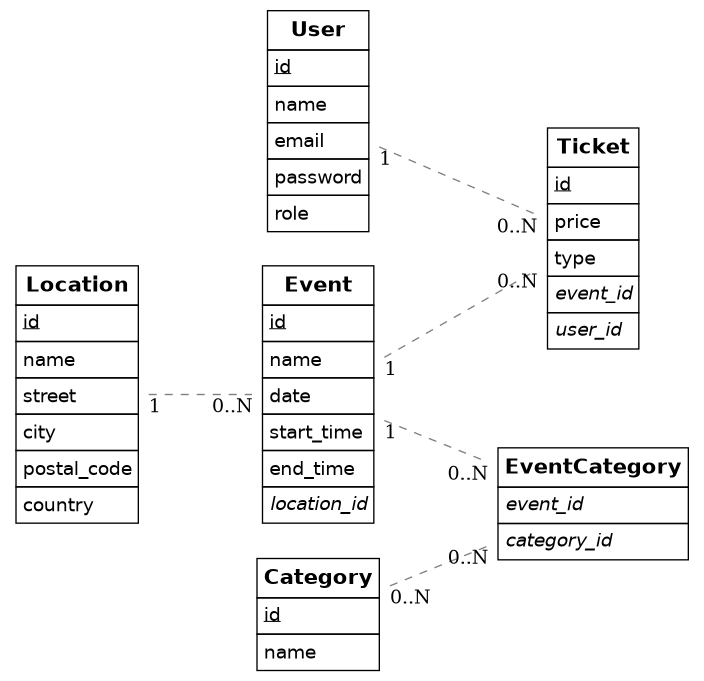

# Dossier

## 📋 Studentgegevens

- **Student:** Arne Bogaert
- **Studentennummer:** 230912176089
- **E-mailadres:** <arne.bogaert@student.hogent.be>
- **GitHub repository:** <https://github.com/HOGENT-frontendweb/frontendweb-2526-bogaertarne>
- **Online versies:**
  - **Back-end:** <https://frontendweb-2526-bogaertarne.onrender.com>
- **Demo:** <LINK_NAAR_DEMO_VIDEO>

## 🔐 Logingegevens

### Administrator Account (Volledige Toegang)

| Omgeving | E-mailadres | Wachtwoord | Rol | Opmerkingen |
| :--- | :--- | :--- | :--- | :--- |
| **Lokaal** | `arne.bogaert@example.com` | `12345678` | `admin` | Kan Events/Tickets/Users/Categorien/Locaties beheren. |
| **Online** | `arne.bogaert@example.com` | `12345678` | `admin` | Kan Events/Tickets/Users/Categorien/Locaties beheren. |

### Standaard Gebruiker Account (Beperkte Toegang)

| Omgeving | E-mailadres | Wachtwoord | Rol | Opmerkingen |
| :--- | :--- | :--- | :--- | :--- |
| **Lokaal** | `marie.claes@example.com` | `12345678` | `user` | Kan eigen tickets en account beheren. |
| **Online** | `marie.claes@example.com` | `12345678` | `user` | Kan eigen tickets en account beheren. |

## 📖 Projectbeschrijving

Ik heb gekozen om als project een Event & Ticket Manager te maken. Het is een webapplicatie waarmee gebruikers muziekevenementen kunnen bekijken en tickets kunnen kopen. De applicatie beheert informatie over evenementen, locaties, tickets, gebruikers en categorieën van evenementen.

De doelgroep van dit project is iedereen die graag tickets wilt kopen voor events en dit op een makkelijke overzichtelijke manier wilt doen.

Belangrijke functionaliteiten:

- Gebruikers kunnen evenementen bekijken en tickets reserveren of kopen.
- Evenementen worden gekoppeld aan locaties en categorieën (genres).
- Beheerders kunnen evenementen, locaties en categorieën beheren.
- Tickets worden gekoppeld aan zowel gebruikers als evenementen, waardoor overzicht en administratie mogelijk zijn

## Belangrijkste entiteiten en relaties

### Entiteiten

**User**  

- Gebruikers van de applicatie (klanten of admins).  
- Attributen: `id`, `name`, `email`, `password`, `role`.

**Event**  

- Muziekevenementen die in de app worden weergegeven.  
- Attributen: `id`, `name`, `date`, `start_time`, `end_time`, `location_id`.

**Location**  

- Locaties waar evenementen plaatsvinden.  
- Attributen: `id`, `name`, `street`, `city`, `postal_code`, `country`.

**Ticket**  

- Tickets die door gebruikers kunnen worden gekocht voor events.  
- Attributen: `id`, `price`, `type`, `event_id`, `user_id`.

**Category**  

- Genre of type van events (bijv. Rock, Jazz, Pop).  
- Attributen: `id`, `name`.

**EventCategory**  

- Linktabel die de veel-op-veel-relatie tussen Event en Category beheert.  
- Attributen: `event_id`, `category_id`.

---

### Relaties

- **User – Ticket**: 1:N  
  - Een gebruiker kan meerdere tickets kopen, maar elk ticket hoort bij één gebruiker.

- **Event – Ticket**: 1:N  
  - Elk event kan meerdere tickets hebben, elk ticket hoort bij één event.

- **Location – Event**: 1:N  
  - Eén locatie kan meerdere events huisvesten, elk event vindt plaats op exact één locatie.

- **Event – Category via EventCategory**: M:N  
  - Een event kan meerdere categorieën hebben en een categorie kan aan meerdere events gekoppeld worden.  
  - `EventCategory` fungeert als de linktabel voor deze veel-op-veel-relatie.

## ✅ Ontvankelijkheidscriteria

- [x] Het project van Web Services voldoet aan **alle** ontvankelijkheidscriteria zoals beschreven in de rubrics.

## 🚀 Extra technologieën

### 1. PDF Generatie (Tickets)

- **Technologie:** `pdfkit`
- **Beschrijving:** Een functionaliteit toegevoegd aan de `TicketsService` waarmee gebruikers hun ticket kunnen downloaden als PDF-bestand. De PDF bevat dynamische informatie zoals de eventnaam, datum, locatie en de naam van de bezoeker.
- **Waarom:** Dit maakt de applicatie bruikbaarder in de echte wereld, zodat gebruikers een fysiek of digitaal bewijs van hun aankoop hebben om te tonen aan de ingang.

### 2. Rate Limiting (Security)

- **Technologie:** `@nestjs/throttler`
- **Beschrijving:** Ik heb globale rate limiting ingesteld (maximaal 15 requests per minuut) om de API te beschermen tegen misbruik.
- **Waarom:** Dit is essentieel voor de beveiliging van een publieke API. Het voorkomt brute-force aanvallen (bijv. op login endpoints) en beschermt de server tegen overbelasting (DDoS).

### 3. Response Compression (Performance)

- **Technologie:** `compression` (Gzip)
- **Beschrijving:** Middleware toegevoegd in `main.ts` die automatisch HTTP-responses comprimeert voordat ze naar de client worden gestuurd.
- **Waarom:** Dit verkleint de hoeveelheid data die over het netwerk wordt verstuurd aanzienlijk (tot wel 70% voor JSON). Dit zorgt voor snellere laadtijden en een betere gebruikerservaring, vooral op mobiele netwerken.

### 4. Unit Testing met Mocks

- **Technologie:** `Jest` & `@nestjs/testing`
- **Beschrijving:** Naast de verplichte E2E-tests heb ik uitgebreide unit tests geschreven voor de `UsersService` en `TicketsService`. Hierbij heb ik de database-connectie volledig gemockt.
- **Waarom:** Door dependencies te mocken, testen we puur de business logica in isolatie. Dit verhoogt de betrouwbaarheid van de code en zorgt voor tests die razendsnel uitvoeren zonder een database nodig te hebben. Dit bracht de totale code coverage boven de 90%.

### Web Services Packages

- [pdfkit](https://www.npmjs.com/package/pdfkit)
  - **Reden van keuze:** Gebruikt om dynamisch PDF-tickets te genereren in de backend.

- [@nestjs/throttler](https://www.npmjs.com/package/@nestjs/throttler)
  - **Reden van keuze:** Toegevoegd om Rate Limiting toe te passen op de API.

- [compression](https://www.npmjs.com/package/compression)
  - **Reden van keuze:** Implementatie van Gzip-compressie voor HTTP-responses.

## 🤔 Reflectie

**Wat heb je geleerd?**

Ik heb enorm veel bijgeleerd tijdens dit project. Ik heb geleerd om gestructureerder te werken en het belang in te zien van een goeie projectstructuur. Ik heb ook veel bijgeleerd over de technologieen die we hebben gebruikt. Een paar voorbeelden zijn: Typescript, Docker, Postman, MySQL en ook nog een heleboel packages die je in je projecten kan gebruiken.

**Wat vond je goed aan dit project?**

Ik vond het positief dat de cursus een beperkte uitleg geeft en dat we sommige dingen zelf moesten uitzoeken. Dit zorgt ervoor dat je meer bijleert dan je eigenlijk denkt.

**Wat zou je anders doen?**

Als ik het opnieuw zou doen zou ik mijn manier van werken aanpassen. Soms verloor ik veel tijd omdat ik de kleinste details wou perfectioneren.

**Wat waren de grootste uitdagingen?**

Mijn grootste uitdaging was het juist instellen van de databank. Ik heb altijd veel fouten gekregen bij de databank en bij het injecteren in de services. Ik dacht niet altijd goed na over de structuur van mijn databank en maakte dus veel fouten hierbij.

**Wat zou je behouden aan de cursus?**

Ik zou de algemene structuur die er nu is zeker behouden. Alles was logisch opgebouwd en goed verstaanbaar. Er waren altijd duidelijke instructies waardoor we wisten wat we moesten doen.

**Wat zou je toevoegen/aanpassen?**

- Het zou misschien handig zijn om de service testen met mocks standaard in de cursus te implementeren. Ik heb gemerkt dat deze testen veel deden om de coverage van de services omhoog te krijgen en dit is ook een handig onderdeel van typescript die we goed kunnen gebruiken in toekomstige projecten. De mensen die deze extra niet hebben gedaan missen dus een belangrijk deel kennis.

- Rate limiting is ook een goeie om standaard te implementeren in de cursus aangezien dit best-practice is bij echte API's
